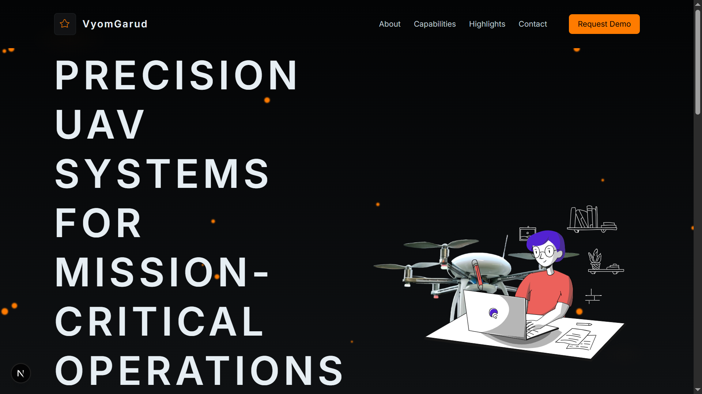

## Getting Started

### clone repository

First, clone repo:

```bash
git clone https://github.com/Bhushan-04/vyomgarud-assessment.git

```

### change folder and install dependencies

```bash
cd landing_page

npm install
```

### run application
Now, run the development server:

```bash
npm run dev
# or
yarn dev
```

Open [http://localhost:3000](http://localhost:3000) with your browser to see the result.

## Screenshots



## demo

Open [https://vyomgarud-assessment.vercel.app/](https://vyomgarud-assessment.vercel.app/) to see demo

